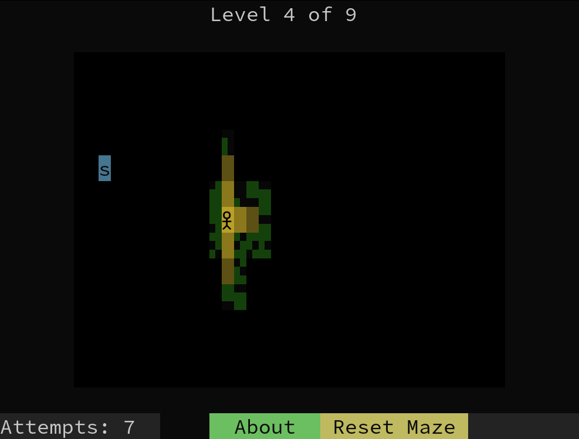
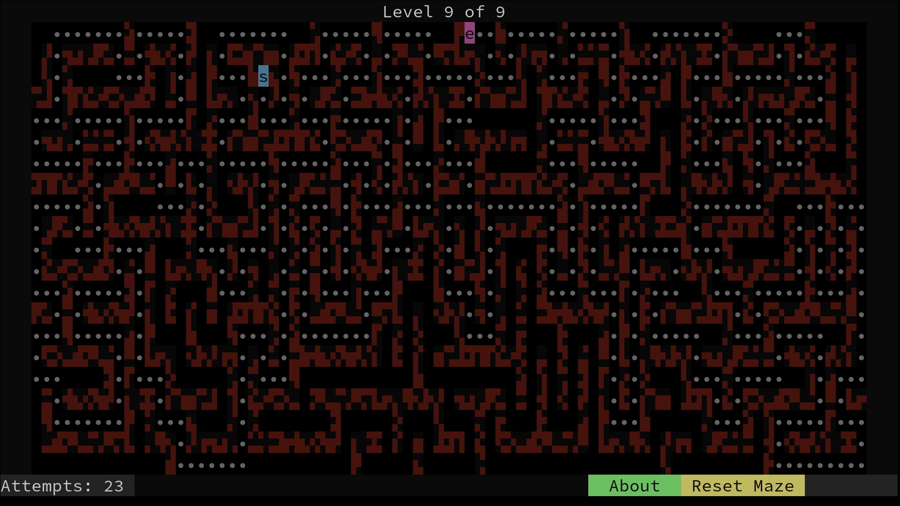

# Lantern 🕯️

Complete each maze in the least number of steps possible.

The wanderer is reset if this step count is reached without completing the maze.

Complete each level in the least number of attempts.

  

## Controls

- Movement: Arrow Keys / `wasd` / `hjkl`
- Reset Level: `r`
- Exit App: `Ctrl c`

  

## Build

git submodules are used to pull in dependencies, run `git submodule update
--init --recursive` after cloning the repo.

CMake is the supported build generator, it generates the `lantern` executable
target. Requires a C++20(concepts) capable compiler.

## Cheats

You didn't hear it from me, but if you press `Shift` + `N`, you will jump
forward one level.
